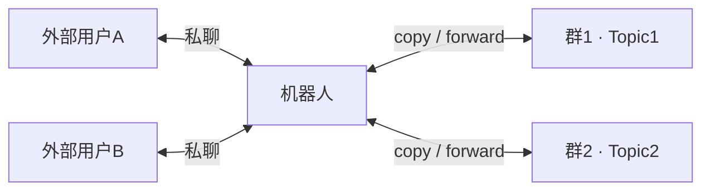
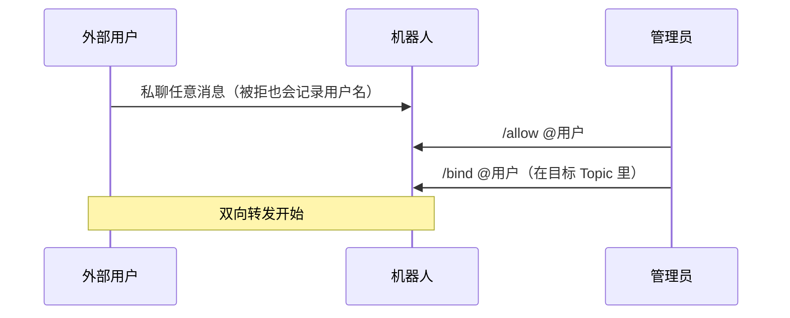

# TG 群 Topic 桥接机器人 · 傻瓜操作手册

> 这份手册覆盖：部署、日常操作、常见场景、故障排查、安全与备份。全程不用懂代码。

## 1. 它是干什么的

把「群里的某一个 Topic」和「群外的用户」双向桥接：群外用户私聊机器人收发消息，群内成员在 Topic 里正常发言，两边互相同步。



核心原则：**只转发指定群 + 指定 Topic 的消息**，其他内容一律隔离。

## 2. 部署（约 30 分钟）

```mermaid
flowchart TD
    A[BotFather 创建机器人] --> B[关闭隐私模式<br>或设为群管理员]
    B --> C[群开启 Topics<br>创建目标 Topic]
    C --> D[拉机器人进群<br>设为管理员]
    D --> E[获取群 ID / Topic ID]
    E --> F[填写 .env]
    F --> G[部署到 VPS]
    G --> H[群里 /set_topic]
    H --> I[用户私聊一次]
    I --> J[/allow 放行]
    J --> K[/bind 绑定]
```

### 2.1 创建机器人

1. Telegram 打开 `@BotFather`，发送 `/newbot`；
2. 起显示名和 @用户名（必须以 `bot` 结尾）；
3. 复制 token；
4. `/mybots` → 机器人 → Bot Settings → Group Privacy → **Turn off**。

> 第 4 步也可以换成：把机器人设为群管理员并勾选「读取消息」，二选一即可。

### 2.2 准备群

1. 群里开启 **Topics（话题）**，创建目标 Topic；
2. 把机器人拉进群；
3. 群信息 → 管理员 → 添加管理员 → 勾选「读取消息」「发送消息」（顺手勾「管理话题」）；
4. 在目标 Topic 里发 `/topic` 获取群 ID 和 Topic ID。

### 2.3 填配置并部署

1. 把 `.env.example` 复制为 `.env`；
2. 填写 `BOT_TOKEN`、`GROUP_CHAT_ID`（其他可以留空）；
3. 上传到 VPS（scp 或 WinSCP）；
4. SSH 登录后执行：

```bash
cd /opt/tg-topic-bridge
bash deploy/install.sh
```

5. 看日志确认：

```bash
docker compose logs -f
```

看到 `机器人启动` 即成功。

## 3. 日常命令

### 3.1 外部用户（私聊机器人）

| 命令 | 作用 |
|---|---|
| `/id` | 查看自己的数字 ID（未放行也能用） |
| `/start` | 连接默认主题 |
| `/stop` | 断开连接 |
| `/status` | 查看自己的目标 |
| `/help` | 帮助 |

### 3.2 群管理员（在群里）

| 命令 | 作用 |
|---|---|
| `/set_topic` | 把当前 Topic 设为默认话题（在目标 Topic 里发） |
| `/topic` | 查看群 ID 和 Topic ID |
| `/allow @用户` | 加入白名单 |
| `/disallow @用户` | 移出白名单并清除全部绑定；仅当用户确实在白名单中时，才推送会话结束通知 |
| `/bind @用户` | 把用户绑定到当前 Topic；若用户不在白名单中会自动加入 |
| `/deletetopic yes` | 删除当前话题，同时自动解绑该话题用户、移出白名单并通知（需“删除消息”权限） |
| `/unbind @用户` | 解除绑定，回到默认订阅 |
| `/add @用户` | 加入默认订阅 |
| `/remove @用户` | 彻底移除 |
| `/status` | 查看桥接状态 |
| `/leave` | 让机器人退出当前群 |

### 3.3 全局管理员（私聊机器人）

| 命令 | 作用 |
|---|---|
| `/groups` | 查看机器人所在的群 |
| `/forgetgroup 群ID` | 把某群从 `/groups` 记录中移除 |
| `/leave 群ID` | 远程让机器人退群 |
| `/addadmin @用户` | 添加全局管理员 |
| `/removeadmin @用户` | 移除全局管理员 |
| `/admins` | 查看全局管理员列表 |
| `/setdefaultgroup 群ID` | 更改默认群 |
| `/setdefaulttopic TopicID` | 更改默认 Topic |

### 3.4 权限速记

| 身份 | 能做什么 |
|---|---|
| 白名单成员 | 只能私聊收发消息 |
| 群管理员 | 管理命令（限本群） |
| 全局管理员 | 全部命令（含私聊管理） |

> 编辑同步：`copy` 模式下，群里编辑消息，外部用户收到的复制品会自动更新；外部用户编辑私聊消息，群里的复制品也会更新（文本、图片/视频/动画/音频/文件）。`forward` 模式不支持编辑。删除消息没有事件，删除无法同步。

## 4. 常用场景

### 场景 1：一个群、一个 Topic、一个外部用户



### 场景 2：一个群、多个 Topic、多个用户

每个 Topic 里各绑各的用户：

- Topic1 里发 `/bind @用户A`
- Topic2 里发 `/bind @用户B`
- Topic3 里发 `/bind @用户C`

> 删除某个 Topic：**推荐在话题内发 `/deletetopic yes`**，机器人删除话题的同时自动解绑该话题用户、移出白名单并推送“会话结束”通知（即时可靠，需机器人勾选“删除消息”权限）。
>
> 若用 Telegram 界面直接删除，机器人收不到事件，只能在该用户下次私聊发消息时自动检测清理；想立即清理可手动 `/disallow @用户`。

### 场景 3：多个群

同一个机器人加入多个群，每个群里重复「设管理员 → /allow → /bind」即可，互不干扰。

### 场景 4：频道

1. 把机器人设为频道管理员（勾「发布消息」）；
2. 在频道里发 `/allow @用户`，自动完成「白名单 + 绑定频道」；
3. 频道消息转发给用户，用户私聊以机器人名义发到频道。

### 场景 5：白名单管理

- 默认**全拒**：白名单为空时任何人不能用；
- 新用户先私聊一次（会被拒），然后管理员 `/allow @用户名`；
- `/disallow @用户名` 移出白名单并清除全部绑定；仅当用户确实在白名单中时，才推送会话结束通知。

### 场景 6：迁移默认群

```bash
/setdefaultgroup 新群ID
/setdefaulttopic 新TopicID
```

（前提：机器人已加入新群并设为管理员。）

## 5. 故障排查速查表

| 症状 | 原因 | 解决 |
|---|---|---|
| 私聊正常，群消息没反应 | 机器人不在该群 / 没勾读取消息 | 拉进群并设为管理员 |
| `/status` 没反应 | 机器人没运行 / 抢 token | `docker compose ps`、只留一个实例 |
| 回复“未知命令” | 旧代码 | `git pull` + `docker compose up -d --build` |
| 用户收不到消息 | 没先私聊过 / 被屏蔽 | 先私聊一次；被屏蔽会自动移除 |
| 新用户说没权限 | 白名单全拒 | 先私聊一次，再 `/allow` |
| 转发失败 | 群禁止转发 / 内容受保护 | 换 `copy` 模式或接受限制 |
| VPS 连不上 Telegram | 机房在国内 | 换海外机房或配代理 |

## 6. 安全清单

- ✅ 日志已自动脱敏 token（显示 `***`）；
- ✅ 白名单默认全拒；
- ⚠️ token 泄露过 → BotFather `/revoke` 换新；
- ⚠️ 任何人都能拉机器人进群 → BotFather 关闭 **Allow Groups**，或只保留自己群的绑定；
- ⚠️ VPS 上执行 `chmod 600 .env`；
- ⚠️ 别把 `docker compose logs` 完整贴到公开渠道。

## 7. 更新与备份

### 更新代码

```bash
cd /opt/tg-topic-bridge
git checkout -- bot.py
git pull
docker compose up -d --build
```

### 备份（建议每天）

```bash
mkdir -p /root/backups
```

`crontab -e` 里加一行：

```
0 3 * * * cp /opt/tg-topic-bridge/data/bridge.json /root/backups/bridge-$(date +\%F).json && cp /opt/tg-topic-bridge/.env /root/backups/env-$(date +\%F) && ls -t /root/backups/bridge-*.json | tail -n +8 | xargs -r rm
```

### 恢复

把备份的 `bridge.json` 放回 `/opt/tg-topic-bridge/data/`，`.env` 放回项目目录，然后：

```bash
docker compose up -d
```

## 8. 速查卡（贴墙上）

```
部署：clone → .env → install.sh → /set_topic
放行：用户私聊一次 → /allow @用户
绑定：目标Topic里 → /bind @用户
查看：/status（群内） /groups（私聊管理员）
踢群：/leave 群ID（私聊管理员）
更新：git pull → docker compose up -d --build
备份：cp data/bridge.json 到本地
```
